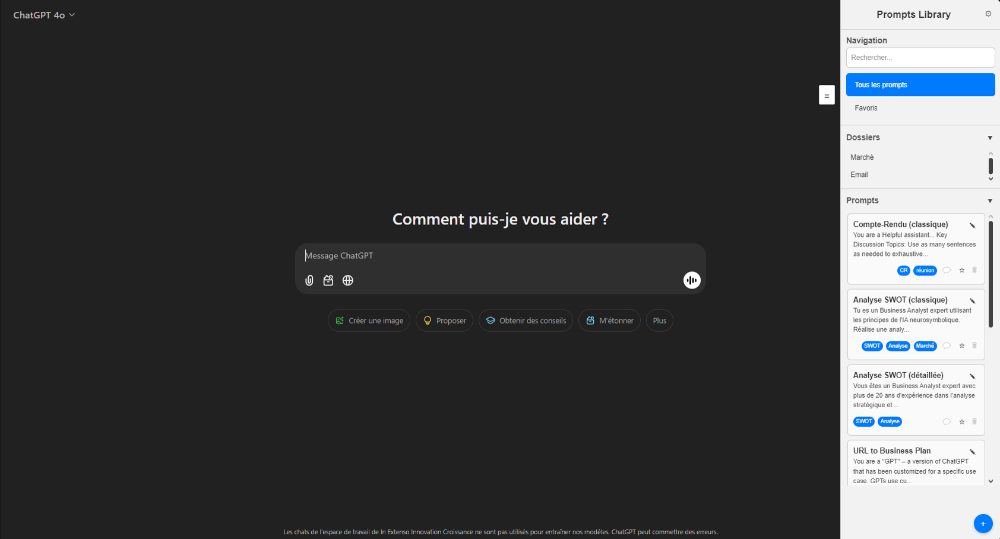

# ChatGPT Prompt Manager

ChatGPT Prompt Manager is a Chrome extension that lets you store your favorite prompts locally and quickly insert them into the ChatGPT textbox.

## Features

- Save prompts in folders for easy organization
- Inject any saved prompt directly into ChatGPT
- Import/export your prompt library as CSV

## Installation

1. Clone or download this repository.
2. In Chrome, open `chrome://extensions` and enable **Developer mode**.
3. Click **Load unpacked** and select the project directory.

The extension is now available when you visit [chat.openai.com](https://chat.openai.com) or [chatgpt.com](https://chatgpt.com).

## Usage

1. Open ChatGPT in your browser.
2. Click the extension's icon to toggle the sidebar.
3. Create folders and prompts, then click a prompt to insert it into the conversation.

## Project Structure

- `manifest.json` – extension manifest
- `html/` – sidebar HTML
- `css/` – stylesheets for the sidebar
- `js/` – content scripts and services
- `Image1.png` – example screenshot

## Contributing

Contributions are welcome! See [CONTRIBUTING.md](CONTRIBUTING.md) for guidelines on how to get started.

## License

This project is licensed under the [MIT License](LICENSE).
